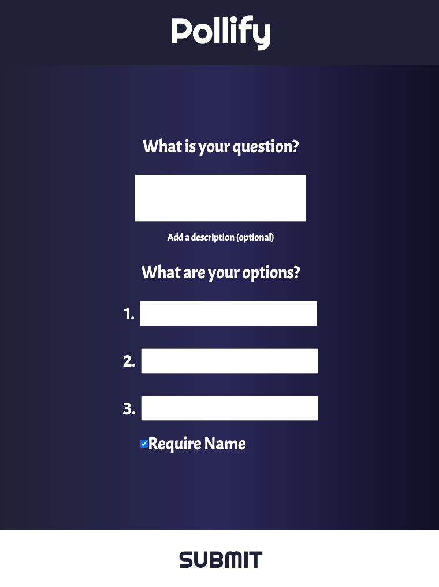
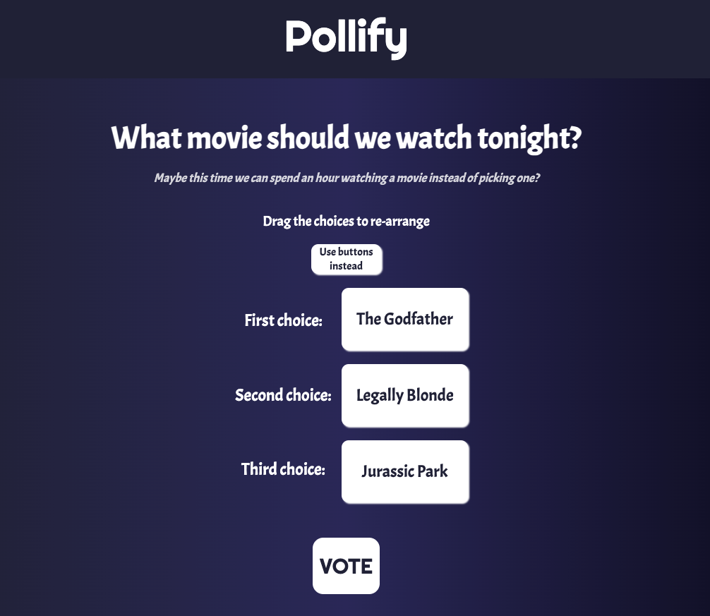
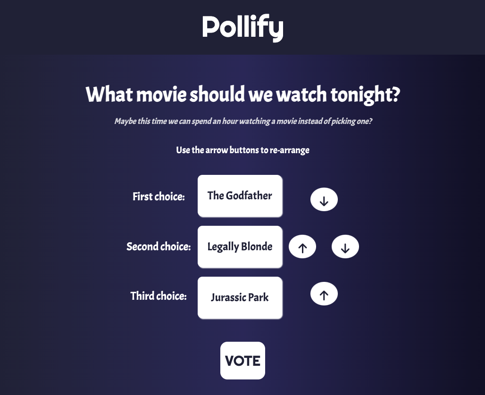
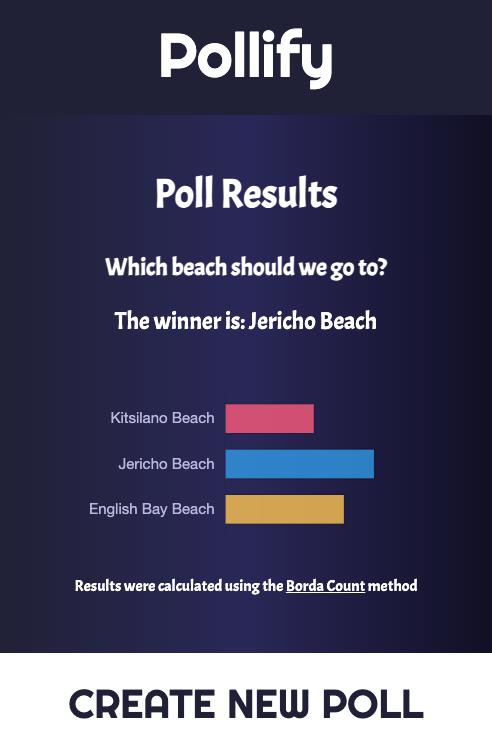

Pollify
=========

## Introduction
Pollify is a decision maker app that allows you to generate a poll with three options. You will receive links in the email you signup with to share the poll with others to vote on. Voters re-arrange the choices from most to least preferred and submit their results. The poll creator will then receive an e-mail to notify them that someone has voted with a link to view the results.

User submissions give points to each option based on the [Borda count method](https://en.wikipedia.org/wiki/Borda_count). All user result point values are totalled and shown on the result chart. The higher the points, the more preferable the option was to voters!

This app was created in a week by Bastien Moy, Karma Mann, and Lindsay Ward as a midterm project for the Lighthouse Labs Web Development bootcamp. Each contributor worked on the database, back-end, and front-end of the app.

## Getting Started

1. Create the `.env` by using `.env.example` as a reference: `cp .env.example .env`
2. Update the .env file with your correct local information 
  - username: `labber` 
  - password: `labber` 
  - database: `midterm`
3. Install dependencies: `npm i`
4. Fix to binaries for sass: `npm rebuild node-sass`
5. Reset database: `npm run db:reset`
  - Check the db folder to see what gets created and seeded in the SDB
7. Run the server: `npm run local`
  - Note: nodemon is used, so you should not have to restart your server
8. Visit `http://localhost:8080/`

## Dependencies

- Node 10.x or above
- NPM 5.x or above
- PG 6.x

## Screenshots

